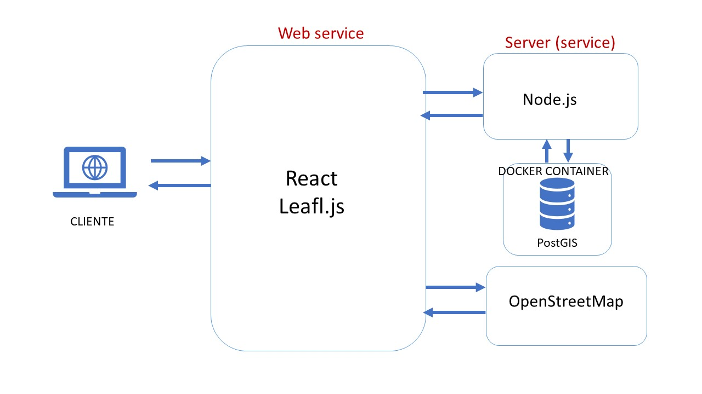

# 1. Diseño de la solución

# 2. Servicios

## Base de Datos en Docker Container -> cmontealegre/opi_test_server:v0
## Servidor -> server (http://localhost:3002/api/layers/layer)
## Web -> aplicación base examen (http://localhost:3000/apps/fullstack_base)

# 3. Instrucciones para levantar

## Requisitos

* Node.js
* Docker

This project was bootstrapped with [Create React App](https://github.com/facebook/create-react-app).

## Instrucciones

Abrir una terminal y ejecutar los siguientes comandos:

### `docker pull cmontealegre/opi_test_server:v0`

### `docker create --name OPI_test_db -p 5433:5432 -t -v pg_data:/var/lib/postgresql cmontealegre/opi_test_server:v0`

### `docker start OPI_test_db`

Para instalar las dependencias:

### `npm install`

Para correr la aplicación

### `npm start`

Puedes abrir la aplicacion entrando a [localhost:3000](http://localhost:3000) en tu explorador.

## Documentación

[React](https://reactjs.org/)

[Leafle.js](https://leafletjs.com/)

[PostgreSQL](https://www.postgresql.org/docs/)

[PostGIS](https://postgis.net/documentation/)

[Docker & Docker Compose](https://docs.docker.com/reference/)

[OpenStreetMap](https://wiki.openstreetmap.org/wiki/Main_Page)
